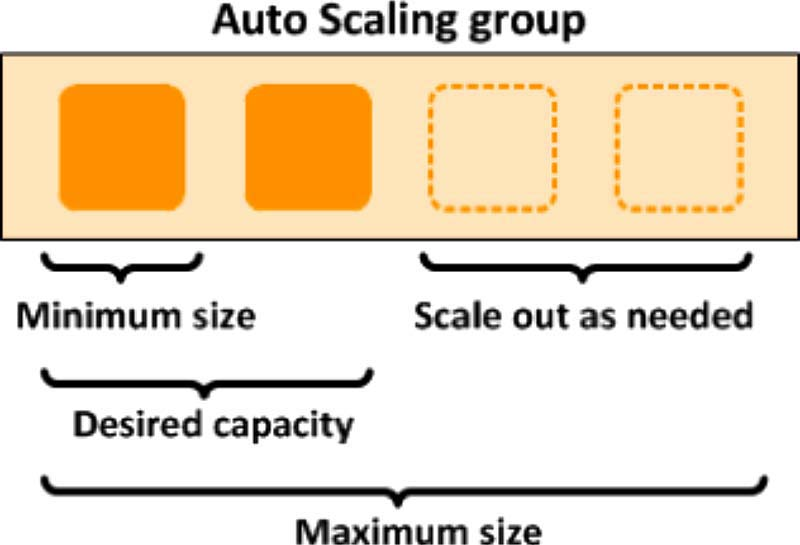
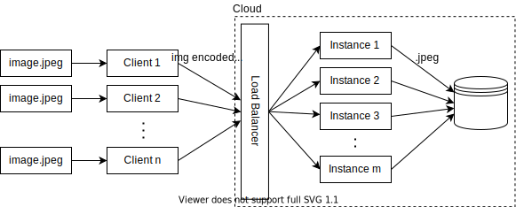
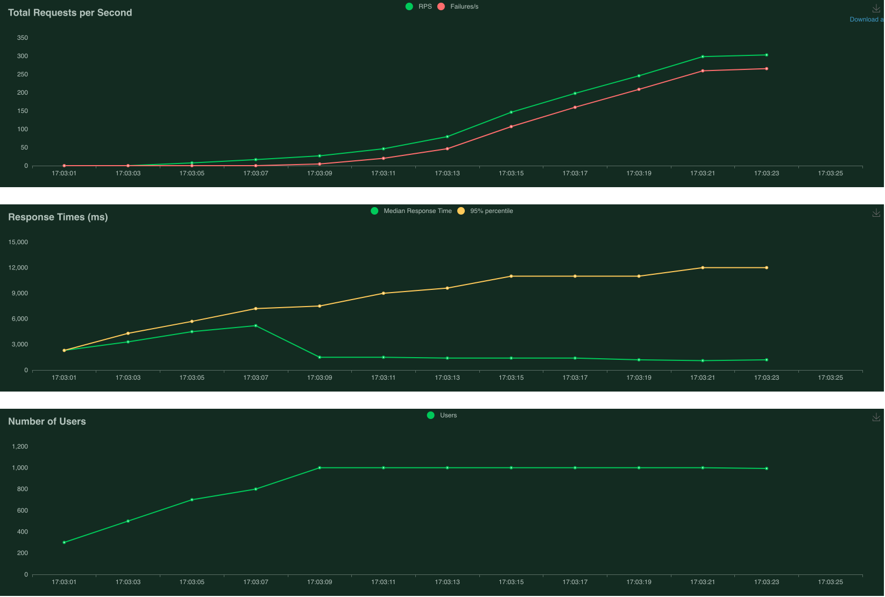
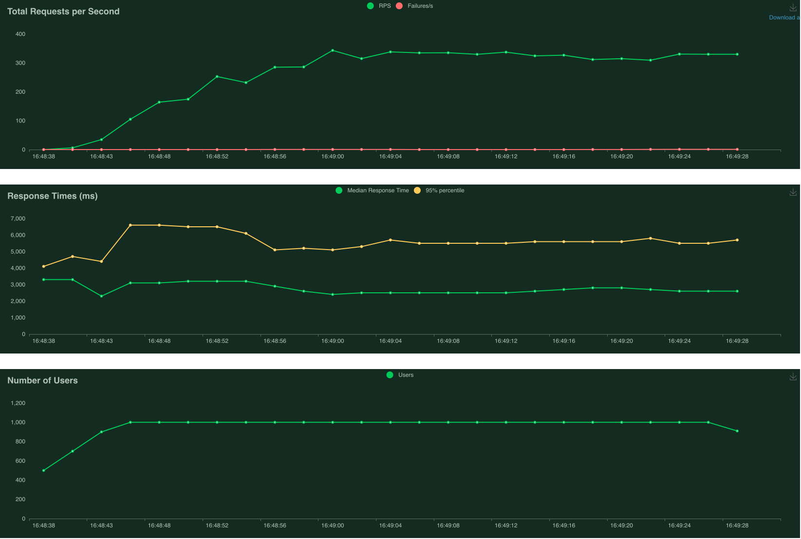
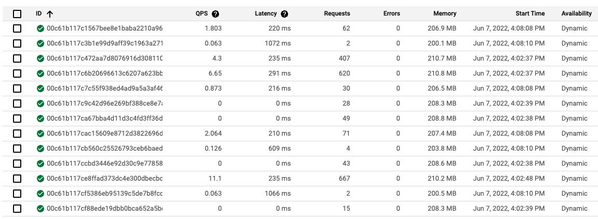
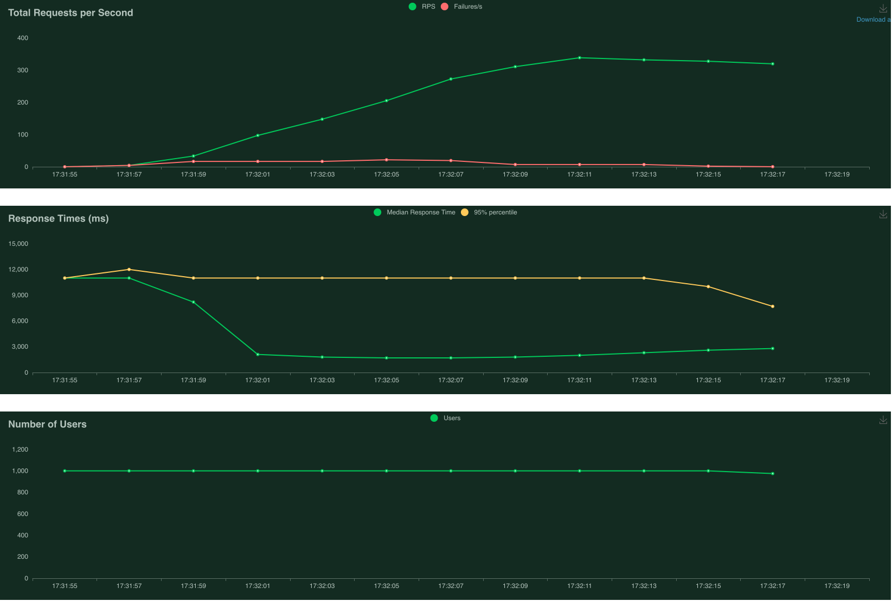

# Autoscaling Computer Vision Inference in the Cloud

## Table of Contents:
- [Overview](#overview)
- [Architecture](#architecture)
- [Tools Used](#tools-used)
- [Load Test Conditions](#load-test-conditions)
- [Google App Engine Results](#google-app-engine-results)
    - [Without Autoscaling](#without-autoscaling)
    - [With Autoscaling](#with-autoscaling)
    - [Adding Initialisation Time](#adding-initialisation-time)
- [Google Cloud Run Results](#google-cloud-run-results)
    - [Lean vs Heavy Base Container Images](#lean-vs-heavy-base-container-images)
    - [Concurrency and CPU Utilisation](#concurrency-and-cpu-utilisation)
- [Other Findings](#other-findings)

## Overview

This repository consolidates the code used and results collected from experimenting with **autoscaling Computer Vision (CV) inference instances** in the cloud. Before we proceed further, a couple of terms will be explained in the following paragraphs.

What is a **CV inference instance**? Here, I define it as a **single** virtual machine (VM) or serverless application, running a CV AI model such as YOLO for object detection. For example, an instance receives an image of this cute Shiba Inu, and the CV model correctly infers that it is a "Dog", returning the predicted image with a superimposed bounding box and label.

 
*CV Inference on Dog*

What about **autoscaling**? It is a cloud computing feature that dynamically adjusts the number of compute resources (such as VMs) as the load varies. This has several advantages compared to a fixed machine - if the load decreases, scaling down reduces costs, while if the load increases, scaling out allows the demand to be met. There's [scaling out versus scaling up](https://packetpushers.net/scale-up-vs-scale-out/#:~:text=Scaling%20out%20%3D%20adding%20more%20components,it%20can%20handle%20more%20load.) - for the purposes of this project, we will solely focus on scaling out.

 
*Scaling Out with AWS*

Combining what we now know, the following use cases will benefit from the ability to **autoscale CV inference instances**:
- An API where users submit images for inference - the ability to scale down will help to save costs
- A system where the load fluctuates depending on the number of CCTVs, detected instances etc - the ability to scale out will help to maintain a consistent FPS
- Splitting a video feed into frames which are inferred by multiple, cheap CPU instances instead of a single but more expensive GPU VM. This can theoretically be done for models without time aspect (so this excludes object tracking), as each video frame can be inferred independently of other video frames. Each frame has an associated time-stamp, so if there is a need to retrieve all the inferred result in sequence, they can be sorted in post-processing.

## Architecture

The architecture used for these experiments is shown below. It can be described in 3 parts:
1. **Client** - A load testing tool is used to create multiple clients. Each client encodes an image into [base64 format](https://www.geeksforgeeks.org/python-convert-image-to-string-and-vice-versa/), and makes a POST request to the server with the encoded message. This is used to simulate some of the use cases described previously.
2. **Server** - Hosted on the cloud. A load balancer allows all POST requests be made to a common URL, and increases or decreases the number of instances depending on the load.
3. **Storage** - Hosted on the cloud. Stores the inference results from each server instance in .jpeg format.

 
*Architecture Diagram*

## Tools Used

Google Cloud Platform (GCP) is the cloud computing service used here (AWS or Microsoft Azure are other options). GCP has several services which support autoscaling:

| Service | Pros | Cons |
|---------------------------------------------------------|-------|-------|
| [Google App Engine](https://cloud.google.com/appengine)   (Using Standard Environment) |  - Serverless and easy to deploy | - Least control over deployment   - Limited compute resource (max 2GB RAM)   - Does not support containers | 
| [Google Cloud Run](https://cloud.google.com/run) | - Serverless and easy to deploy   - Supports containers   - More control over deployment than App Engine | - Less control over deployment than Kubernetes Engine |
| [Google Kubernetes Engine](https://cloud.google.com/kubernetes-engine) | - More compute power   - Supports containers   - More control over K8s clusters and VMs | - More effort to set up |

Thus, App Engine and Kubernetes Engine are at the 2 extremes, while Cloud Run lies somewhere in between. Another service that supports autoscaling but not be evaluated here is [Compute Engine Managed Instance Groups (MIGs)](https://cloud.google.com/compute/docs/instance-groups/creating-groups-of-managed-instances).

Other key tools used in this study are:
- [Locust](https://locust.io/) - An open source load testing tool which will create multiple client instances to send POST requests to the load balancer on GCP.
- [Google Cloud Storage](https://cloud.google.com/storage) - Object storage to store the resulting image files from CV inference.
- [PeekingDuck](https://github.com/aimakerspace/PeekingDuck) - A CV inference framework. Each instance will be running its own copy of PeekingDuck.
- [FastAPI](https://fastapi.tiangolo.com/) - A high performance web framework that will be used as the server for each instance. [Flask](https://flask.palletsprojects.com/en/2.1.x/) was used initially, but it did not perform as well as FastAPI as it is a development server.

## Load Test Conditions

The Locust load testing tool will be used. Locust will create multiple client instances/users to send repeated POST requests of the Shiba Inu image in base64 format.

The following settings will be used for the load test:
- **Number of users**: 1000
- **Spawn rate**: Ramp up at 100 users/sec till max number of users is reached

If you are familiar with Locust, the [`wait_time`](https://docs.locust.io/en/stable/writing-a-locustfile.html) method is sometimes used to introduce delays after each task execution for each user. However in our case, it is not specified, thus the next task will be executed as soon as one finishes.

What constitutes a failed request? 
- Most of the failures in the subsequent experiments are caused by **503 server errors**, where the server (e.g. app on App Engine) is temporarily unable to handle the request as it is overwhelmed. 
- A very small fraction of failures are **429 client errors**, where the rate of requests is too high, the server detects too many attempts within a short period of time and activates a rate-limiting feature.

Request timeout errors are not encountered as by default, App Engine Standard with automatic scaling has a [10 min timeout](https://cloud.google.com/appengine/docs/standard/python3/how-instances-are-managed#timeout), and Cloud Run has a [5 min timeout](https://cloud.google.com/run/docs/configuring/request-timeout). The plots in the subsequent sections show that the response times do not come anywhere close to these timeout limits.

Lastly, it is important to **wait for the instances to shut down before starting a new experiment**, so that each experiment begins with an equal number of new instances. For App Engine and Cloud Run, it takes approximately 15 minutes of inactivity for the idle instances to start shutting down.

## Google App Engine Results

We will begin this series of experiments with App Engine, as it is the easiest to deploy. There is a catch though - App Engine Standard Environment has a [default timeout of 10 minutes](https://cloud.google.com/build/docs/deploying-builds/deploy-appengine#:~:text=This%20is%20required%20because%20Cloud,than%2010%20minutes%20to%20complete.) (note that this can be modified in App Engine Flexible Environment) for builds and deployments, and this was exceeded when PeekingDuck was included as a dependency as heavy sub-dependencies such as TensorFlow and Pytorch had to be installed.

I decided to exclude PeekingDuck from this App Engine experiment - CV instances here only need to save the received image to Cloud Storage without performing any inference. Thus, the objective here is mainly to try out autoscaling and load testing with Locust, before subsequently moving on to Cloud Run/ Kubernetes Engine with PeekingDuck.

### Without Autoscaling

First, let's see how it performs without autoscaling by setting the `max_instances` config in `app.yaml` to only 1 instance. 

 
*Limited to 1 instance - 83% failure*

The first plot above (Total Requests per Second) shows many failed requests, represented by the **red line**. The second plot above (Response Times) shows the 95% percentile of response time gradually creeping up to about 12 seconds.

### With Autoscaling

Next, let's remove the `max_instances` limitation and see how App Engine performs under the same load conditions.

 
*No limit to instances - 0% failure*

The first plot above (Total Requests per Second) shows that there were no failed requests when autoscaling is enabled. The number of Requests per Second (RPS) stabilises at about 300. The second plot above (Response Times) shows the 95% percentile of response time of about 6 seconds with an average of 3 seconds. Clearly, this run has benefited from autoscaling.

 
*Google App Engine Instances*

The screenshot above from Google App Engine's GUI shows that 13 instances have been spun up to handle the load. The number of requests handled vary across the board - it is likely that the instances which have handled less requests were spun up later. 

### Adding Initialisation Time

It is quite common for CV inference instances to require initialisation time for importing heavy packages such as TensorFlow and OpenCV, or for downloading model weights. This means that while App Engine has spun up a new instance to handle the increased traffic, this new instance is not quite ready to receive traffic yet, which may lead to failures. 

I added a 10 second delay to simulate “initialisation”, and ran the same load test with autoscaling enabled. Some requests started to fail, as expected, as the instances were still undergoing "initialisation". At worst, the failure rate reached about 8%. As more instances completed initialisation, the number of instantaneous failures gradually dropped zero.

 
*With 10 second delay - 8% failure at max*

The red line in first plot above (Total Requests per Second) shows that there were some failed requests about halfway through the run. The median response time in second plot above (Response Times) is also much higher at about 10 seconds at the beginning, before it started dropping and stabilising at 3 seconds. Thus, it is apparent that adding initialisation time does lead to failed requests.

From these experiments with App Engine, we have familiarised ourselves with autoscaling and load testing using Locust. Next, we’ll move on to the main course - autoscaling of PeekingDuck instances, using Cloud Run.

## Google Cloud Run Results

Google Cloud Run gives more control over the deployment compared to Google App Engine, but less compared to Google Kubernetes Engine. Also, Cloud Run is used with containers, thus we will introduce a containerised PeekingDuck into the experiment from here on.

We will **fix** the following Cloud Run settings for these experiments:

- CPU allocation: CPU always allocated, which is recommended when incoming traffic is steady, slowly varying like our load test. More info here.
- Minimum number of instances: `5`, to reduce [cold starts](https://cloud.google.com/run/docs/configuring/min-instances) caused by initialisation time mentioned previously.
- Maximum number of instances: `100`, which is the default.
- Request timeout: `300 seconds`, which is the default.

We will **vary** the following Cloud Run and container settings:

- Base container image
- `Number of vCPUs` allocated to each container instance. The maximum allocatable memory will be chosen based on the number of vCPUs (Cloud Run hardware limitation).
- `Concurrency`, the maximum number of concurrent requests that can reach each container instance.

### Lean vs Heavy Base Container Images

This [Google Cloud blog](https://cloud.google.com/blog/topics/developers-practitioners/3-ways-optimize-cloud-run-response-times) explains that a leaner base image can reduce start-up time for Cloud Run. However, it also states that the size of the container image does not affect start-up time, i.e. similar start-up times should be observed with the following containers:

- With base image “A” and a 20MB data file
- With base image “A” and a 500GB data file

We’ll fix `Number of vCPUs` to be 2vCPU with 8GB RAM, and `Concurrency` to be 100, and run this experiment with the following container images:

- **17.1GB** - [gcr.io/deeplearning-platform-release/base-cu110](http://gcr.io/deeplearning-platform-release/base-cu110) base image, one of Google’s [deep learning containers](https://cloud.google.com/deep-learning-containers/docs/overview) that come packaged with several Python ML packages, JupyterLab, and Nvidia drivers with CUDA and CuDNN.
- **6.5GB** - python:3.7-slim base image.

 
*17.1GB heavy base image - overall 8% failure*

 
*6.5GB heavy base image - overall 8% failure*

Despite the great difference in base image size (2.5x), both experiments have similar failure rates of 8% overall! This seems unexpected, but the following statement from the same [Google Cloud blog](https://cloud.google.com/blog/topics/developers-practitioners/3-ways-optimize-cloud-run-response-times) provides a clue:

> Cold starts aren’t affected by the size of the image, but by the image system complexity and initialization time.

My hunch is that as both containers need to run PeekingDuck, heavy packages such as OpenCV and TensorFlow have to be initialised anyway, bringing them level. Additionally, as the Cloud Run instances are GPU-less, the longer initialisation times usually associated with Nvidia CUDA of the deep learning container does not come into effect here. 

Despite these results, it is still good practice to keep the container image lean, as it can greatly shorten upload and download times. Additionally, while these results are true for Cloud Run, it may not be the case for Kubernetes Engine, especially if each new instance has to download a fresh container image from the registry.

### Concurrency and CPU Utilisation

According to [Google Cloud’s documentation](https://cloud.google.com/run/docs/about-instance-autoscaling), autoscaling in Cloud Run is impacted by:
1. Rate of incoming requests
2. CPU utilisation of existing instances when they are processing requests, with a target to keep scheduled instances at 60% CPU utilisation

Armed with this knowledge, we can create the optimal conditions to enable autoscaling:
- As `concurrency` is the maximum number of concurrent requests that can reach each container instance, we can reduce this so that more instances have to be spun up.
- We can also reduce the compute power of each instance so that the 60% CPU utilisation threshold is reached more often, forcing instances to be created. Interestingly, it does seem counterintuitive that we are reducing compute power in hopes of reducing failures.

We will run another experiment with these new settings:
- `Number of vCPUs`: **1vCPU with 4GB RAM**, reduced from 2vCPU with 8GB RAM
- `Concurrency`: **30**, reduced from 100

 
*After optimising for autoscaling - 0% failures!*

The plots above show that we have succeeded in our goal of achieving 0% failed requests with PeekingDuck! 86 instances were spun up in this run, compared to 38 instances previously, and therefore Cloud Run was able to handle the incoming requests more comfortably. Additional benefits were also reaped from more autoscaled instances:
- Number of requests per second (RPS) significantly increased from ~120RPS to ~300RPS
- Median response times greatly reduced from about 8 seconds to 2 seconds

 
*1vCPU > 60% utilisation (left) vs 2vCPU < 60% utilisation (right)*

Digging deeper into CPU utilisation - the plot above shows that with 1vCPU (left), the median CPU utilisation exceeds the 60% threshold, prompting new instances to be spun up, while with 2vCPU (right), it does not exceed 60% on average.

At this juncture, we have successfully proven that the proposed concept of autoscaling CV inference instances can work in reality, hitting almost **300 requests per second with zero failures**. Next, we’ll take things a step further with Kubernetes Engine, which provides even more control over autoscaling.

## Other Findings

- A timestamp is appended to the filename of each resulting image that is saved to Google Cloud Storage. Multiple resulting images could be produced within the same second, and since they have the same filename, the file would keep getting overwritten. This has caused errors in the past as it exceeded the rate limit of change requests in Cloud Storage. This was fixed by including microseconds to the filename (nanoseconds would only be required for a >1,000 FPS camera which is not realistic for our use case).