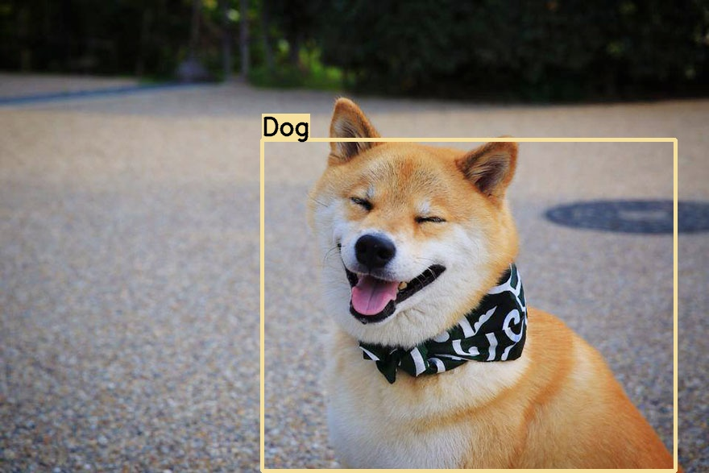

# Autoscaling Computer Vision Inference in the Cloud

## Overview

This repository consolidates the code used and results collected from experimenting with **autoscaling Computer Vision (CV) inference instances** in the cloud. Before we proceed further, a couple of terms will be explained in the following paragraphs.

What is a **CV inference instance**? Here, I define it as a **single** virtual machine (VM) or serverless application, running a CV AI model such as YOLO for object detection. For example, an instance receives an image of this cute Shiba Inu, and the CV model correctly infers that it is a "Dog", returning the predicted image with a superimposed bounding box and label.

 
*CV Inference on Dog*

What about **autoscaling**? It is a cloud computing feature that dynamically adjusts the number of compute resources (such as VMs) as the load varies. This has several advantages compared to a fixed machine - if the load decreases, scaling down reduces costs, while if the load increases, scaling out allows the demand to be met. There's [scaling out versus scaling up](https://packetpushers.net/scale-up-vs-scale-out/#:~:text=Scaling%20out%20%3D%20adding%20more%20components,it%20can%20handle%20more%20load.) - for the purposes of this project, we will solely focus on scaling out.

 
*Scaling Out with AWS*

Combining what we now know, the following use cases will benefit from the ability to **autoscale CV inference instances**:
- An API where users submit images for inference - the ability to scale down will help to save costs
- A system where the load fluctuates depending on the number of CCTVs, detected instances etc - the ability to scale out will help to maintain a consistent FPS
- Splitting a video feed into frames which are inferred by multiple, cheap CPU instances instead of a single but more expensive GPU VM. This can theoretically be done for models without time aspect (so this excludes object tracking), as each video frame can be inferred independently of other video frames. Each frame has an associated time-stamp, so if there is a need to retrieve all the inferred result in sequence, they can be sorted in post-processing.

## Architecture

The architecture used for these experiments is shown below. It can be described in 3 parts:
1. **Client** - A load testing tool is used to create multiple clients. Each client encodes an image into [base64 format](https://www.geeksforgeeks.org/python-convert-image-to-string-and-vice-versa/), and makes a POST request to the server with the encoded message. This is used to simulate some of the use cases described previously.
2. **Server** - Hosted on the cloud. A load balancer allows all POST requests be made to a common URL, and increases or decreases the number of instances depending on the load.
3. **Storage** - Hosted on the cloud. Stores the inference results from each server instance in .jpeg format.

 
*Architecture Diagram*

## Tools Used

Google Cloud Platform (GCP) is the cloud computing service used here (AWS or Microsoft Azure are other options). GCP has several services which support autoscaling:

| Service | Pros | Cons |
|---------------------------------------------------------|-------|-------|
| [Google App Engine](https://cloud.google.com/appengine) |  - Serverless and easy to deploy | - Least control over deployment   - Limited compute resource (max 2GB RAM)   - Does not support containers | 
| [Google Cloud Run](https://cloud.google.com/run) | - Serverless and easy to deploy   - Supports containers   - More control over deployment than App Engine | - Less control over deployment than Kubernetes Engine |
| [Google Kubernetes Engine](https://cloud.google.com/kubernetes-engine) | - More compute power   - Supports containers   - More control over K8s clusters and VMs | - More effort to set up |

Thus, App Engine and Kubernetes Engine are at the 2 extremes, while Cloud Run lies somewhere in between. Another service that supports autoscaling but not be evaluated here is [Compute Engine Managed Instance Groups (MIGs)](https://cloud.google.com/compute/docs/instance-groups/creating-groups-of-managed-instances).

Other key tools used in this study are:
- [Locust](https://locust.io/) - An open source load testing tool which will create multiple client instances to send POST requests to the load balancer on GCP.
- [Google Cloud Storage](https://cloud.google.com/storage) - Object storage to store the resulting image files from CV inference.
- [PeekingDuck](https://github.com/aimakerspace/PeekingDuck) - A CV inference framework. Each instance will be running its own copy of PeekingDuck.
- [FastAPI](https://fastapi.tiangolo.com/) - A high performance web framework that will be used as the server for each instance. [Flask](https://flask.palletsprojects.com/en/2.1.x/) was used initially, but it did not perform as well as FastAPI as it is a development server.

## Google App Engine Results

App Engine has a [default timeout of 10 minutes](https://cloud.google.com/build/docs/deploying-builds/deploy-appengine#:~:text=This%20is%20required%20because%20Cloud,than%2010%20minutes%20to%20complete.) for builds and deployments, and this was exceeded when PeekingDuck was included as a dependency as heavy sub-dependencies such as TensorFlow and Pytorch had to be installed.

While the timeout can be adjusted, I decided to keep the App Engine deployment simple and only use it to try load testing and autoscaling. Thus, I excluded PeekingDuck from App Engine - CV instances here only need to save the received image to Cloud Storage without performing any inference. More details can be found in the [source code](server/app_engine_save_img/main.py). We will simulate an actual real-world use case with PeekingDuck when using Cloud Run and Kubernetes Engine.

### Without Autoscaling

First, let's see how it performs without autoscaling by setting the `max_instances` config in `app.yaml` to only 1 instance. The following settings were used for the load test:
- **Number of users**: 1000
- **Spawn rate**: Ramp up at 100 users/sec till max number of users is reached

 
*Limited to 1 instance - 83% failure*

The first plot above (Total Requests per Second) shows many failed requests, represented by the **red line**. The second plot above (Response Times) shows the 95% percentile of response time gradually creeping up to about 12 seconds.

### With Autoscaling

Next, let's remove the `max_instances` limitation and see how App Engine performs under the same load conditions.

 
*No limit to instances - 0% failure*

The first plot above (Total Requests per Second) shows that there were no failed requests when autoscaling is enabled. The number of Requests per Second (RPS) stabilises at about 300. The second plot above (Response Times) shows the 95% percentile of response time of about 6 seconds with an average of 3 seconds. Clearly, this run has benefited from autoscaling.

 
*Google App Engine Instances*

The screenshot above from Google App Engine's GUI shows that 13 instances have been spun up to handle the load. The number of requests handled vary across the board - it is likely that the instances which have handled less requests were spun up later.

### Adding Initialisation Time

It is quite common for CV inference instances to require initialisation time for importing heavy packages such as TensorFlow and OpenCV, or for downloading model weights. This means that while App Engine has spun up a new instance to handle the increased traffic, this new instance is not quite ready to receive traffic yet, which may lead to failures. 

I added a 10 second delay and ran the same load test with autoscaling enabled. Some requests started to fail, as expected, as the instances were still undergoing "initialisation". At worst, the failure rate reached about 8%. As more instances completed initialisation, the number of instantaneous failures gradually dropped zero.

 
*With 10 second delay - 8% failure at max*

The red line in first plot above (Total Requests per Second) shows that there were some failed requests about halfway through the run. The median response time in second plot above (Response Times) is also much higher at about 10 seconds at the beginning, before it started dropping and stabilising at 3 seconds.

From these results, it is apparent that initialisation time does lead to failures, and we will see how we can mitigate this in the next section on Cloud Run.

## Other Findings

- A timestamp is appended to the filename of each resulting image that is saved to Google Cloud Storage. Multiple resulting images could be produced within the same second, and since they have the same filename, the file would keep getting overwritten. This has caused errors in the past as it exceeded the rate limit of change requests in Cloud Storage. This was fixed by including microseconds to the filename (nanoseconds would only be required for a >1,000 FPS camera which is not realistic for our use case).